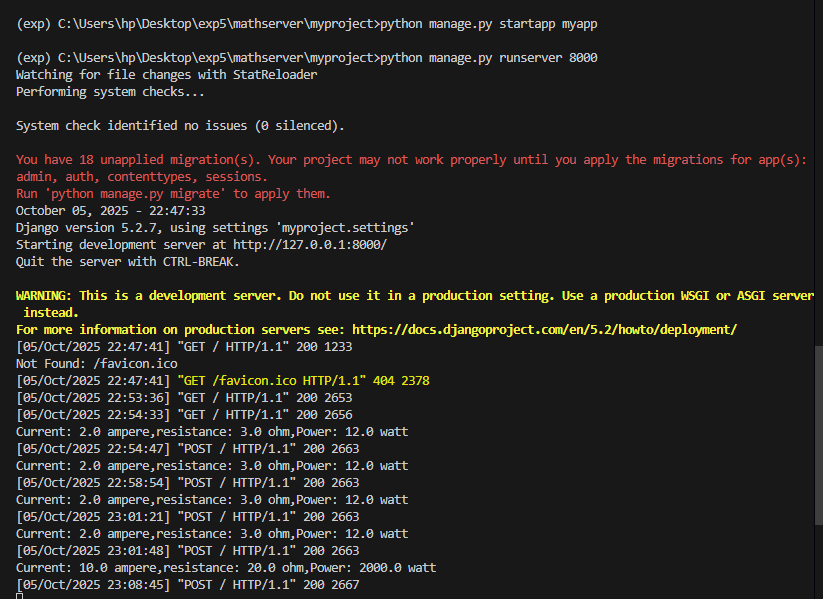

# Ex.05 Design a Website for Server Side Processing
# Date:05/10/2025
# AIM:
To design a website to calculate the power of a lamp filament in an incandescent bulb in the server side.

# FORMULA:
P = I2R
P --> Power (in watts)
 I --> Intensity
 R --> Resistance

# DESIGN STEPS:
## Step 1:
Clone the repository from GitHub.

## Step 2:
Create Django Admin project.

## Step 3:
Create a New App under the Django Admin project.

## Step 4:
Create python programs for views and urls to perform server side processing.

## Step 5:
Create a HTML file to implement form based input and output.

## Step 6:
Publish the website in the given URL.

# PROGRAM :
```
math.html

<!DOCTYPE html>
<html lang="en">
<head>
    <meta charset="UTF-8">
    <meta name="viewport" content="width=device-width, initial-scale=1.0">
    <title>Power Calculating</title>
    <style>
        body {
            margin: 0;
            font-family: 'Segoe UI', Tahoma, Geneva, Verdana, sans-serif;
            background: linear-gradient(to right, #1059c7, #02e4f0); /* Gradient background */
            color: #333;
        }

        fieldset {
            max-width: 500px;
            margin: 100px auto;
            border-radius: 10px;
            background-color: white;
            box-shadow: 0 8px 16px rgba(0, 0, 0, 0.2);
            padding: 30px;
        }

        legend {
            font-size: 22px;
            font-weight: bold;
            padding: 0 10px;
            color: #2c3e50;
        }

        h2, h3 {
            text-align: center;
            margin-bottom: 20px;
        }

        form {
            display: flex;
            flex-direction: column;
            align-items: center;
        }

        label {
            margin-top: 10px;
            font-weight: 600;
        }

        input {
            width: 80%;
            padding: 8px;
            margin-top: 5px;
            border: 1px solid #ccc;
            border-radius: 5px;
            font-size: 16px;
        }

        button {
            margin-top: 20px;
            padding: 10px 25px;
            background-color: #00ff37;
            color: white;
            border: none;
            font-size: 16px;
            border-radius: 5px;
            cursor: pointer;
        }

        button:hover {
            background-color: #e7f707;
        }

        p {
            text-align: center;
            font-size: 16px;
            background-color: #ecf0f1;
            padding: 10px;
            border-radius: 5px;
        }

    </style>
</head>
<body>
    <fieldset>
        <legend>THANZIL HUSSAIN A</legend>
        <h2>Power Calculator</h2>
        <form method="POST">
            
            <label>Current (ampere):</label>
            <input type="text" name="Current" required>
            
            <label>Resistance (ohm):</label>
            <input type="text" name="resistance" required>
            
            <button type="submit">Calculate Power</button>
        </form>

        
        <h2>P (Power) = I<sup>2</sup> × R</h2>
        <h3>Input Values</h3>
        <p>Current: {{Current}} ampere<br>Resistance: {{resistance}} ohm</p>
        <h3>Power: {{power}} watt</h3>
        
    </fieldset>
</body>
</html>

views.py

from django.shortcuts import render
def calculate_power(request):
    P = 1
    I=0
    R=0
    if request.method=="POST":
        I+=float(request.POST.get("Current"))
        R+=float(request.POST.get("resistance"))
        P*=(I**2)*R
        print(f"Current: {I} ampere,resistance: {R} ohm,Power: {P} watt")
        return render(request,'myapp/math.html',{"Current":I,"resistance":R,"power":P})
    return render(request,'myapp/math.html',{"Current":I,"resistance":R,"power":P})

urls.py

from django.contrib import admin
from django.urls import path
from myapp import views

urlpatterns = [
    path('admin/', admin.site.urls),
    path('',views.calculate_power,name="calculate_power"),
]
```

# SERVER SIDE PROCESSING:



# HOMEPAGE:


# RESULT:
The program for performing server side processing is completed successfully.
